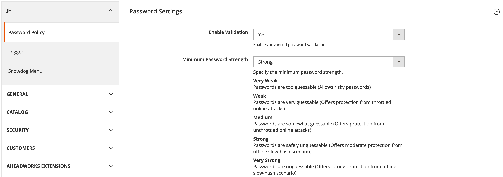

<h1 align="center">JH Password Policy Module</h1>

## Overview
This module adds validation of common passwords to the customer Web API using Dropbox's [zxcvbn
password strength estimator](https://github.com/bjeavons/zxcvbn-php).

## Installation

```sh
$ composer require wearejh/m2-module-password-policy
$ php bin/magento setup:upgrade
```

## Password Scores
Scores are integers from 0 to 4

| Score | Description |
| --- | --- |
| 0 - Very Weak | Passwords are too guessable (Allows risky passwords) |
| 1 - Weak | Passwords are very guessable (Offers protection from throttled online attacks) |
| 2 - Medium | Passwords are somewhat guessable (Offers protection from unthrottled online attacks) |
| 3 - Strong | Passwords are safely unguessable (Offers moderate protection from offline slow-hash scenario) |
| 4 - Very Strong | Passwords unguessable (Offers strong protection from offline slow-hash scenario) |

### Usage
Navigate to the following admin path to manage settings

```
Stores > Configuration > Jh > Password Policy
```

